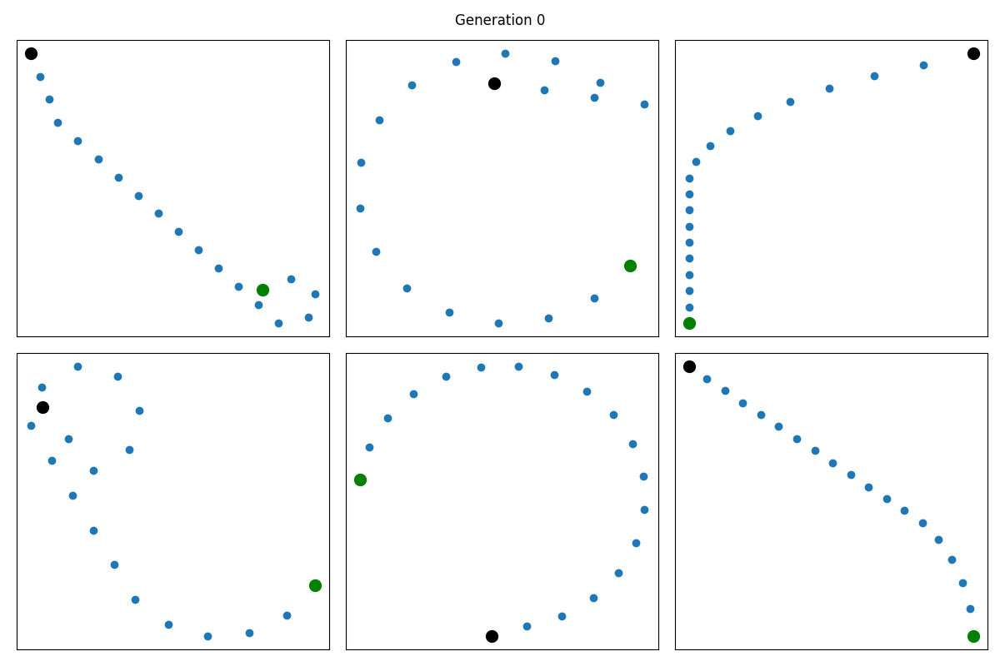
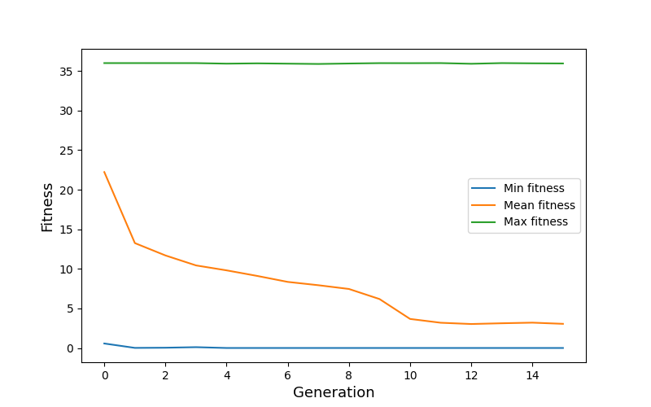
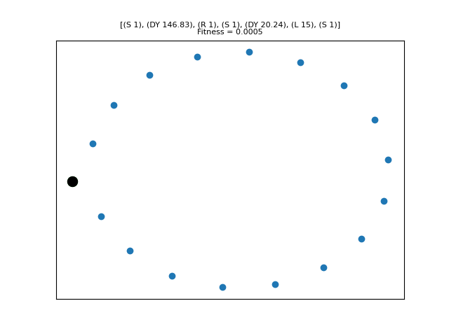

# Solution for 2021 UROP application "Developing Self-Driving Car Autopilots using Reinforcement Learning Algorithms"

<p align="center">
  
  <b>Fig.1 Evolution of the population across generations</b><br>
</p>

This repository contains the solution for the [2021 UROP application task](https://github.com/testingautomated-usi/urop-2021-exercise) which required implementing a Genetic Algorithm that generates closed tracks for the [DonkeyCar](https://www.donkeycar.com/). 

The code provided to generate the tracks has been reused. The code for implementing genetic algorithm is present in `ga/genetic_algorithm.py` which also uses some utility functions from `track_generator/utils.py`.

To run the genetic algorithm, change the parameters in `config.py` (if required) and run:
```bash
python main.py
```

### Genotype

The genotype consists of two arrays, each of length equal to CHROMOSOME_LENGTH:
 1) array containing integer type genes with a value of 0, 1, or 2 indicating the commands S, L, and R respectively.
 2) array containing float type genes with value in the interval [0, 360) representing the rotation degree corresponding to each command in the first array.

For example, the genotype for the sequence of instructions \[(S 6), (DY 15.5), (R 4), (S 3)\] will be:

|   |   |   |   |   |   |   |   |   |   |   |   |   |
|---|---|---|---|---|---|---|---|---|---|---|---|---|
| 0 | 0 | 0 | 0 | 0 | 0 | 2 | 2 | 2 | 2 | 0 | 0 | 0 |
| 0 | 0 | 0 | 0 | 0 | 0 | 15.5 | 15.5 | 15.5 | 15.5 | 0 | 0 | 0 |

### Initial population
The initial population of size POPULATION_SIZE is generated randomly while satisfying the constraints specified in the exercise.

### Selection
According to TOP_SELECTION_RATIO, candidates with best fitness values are selected from the current population to form the mating pool for the next generation.

### Crossover
Two parents are randomly selected from the mating pool. They are combined by mixing their genotypes across a random crossover point to create an offspring for the next generation

### Mutation
For mutation, a portion of track of the offspring obtained after crossover is selected and modified randomly. The number of offsprings to be mutated is determined by MUTATION_PROB.

## Results
Figure 1 shows some random population samples from 15 generations (start point is shown in green and end point in black). Figure 2 shows the evolution of min, mean, and max fitness of the population.

<p align="center">
  
  <b>Fig.2 Change in fitness across generations</b><br>
</p>

Multiple best solutions were obtained after 15 generations with a fitness value of 0.0005. One of these solutions has been shown in figure 3. 
<p align="center">
  
  <b>Fig.3 Best solution</b><br>
</p>
